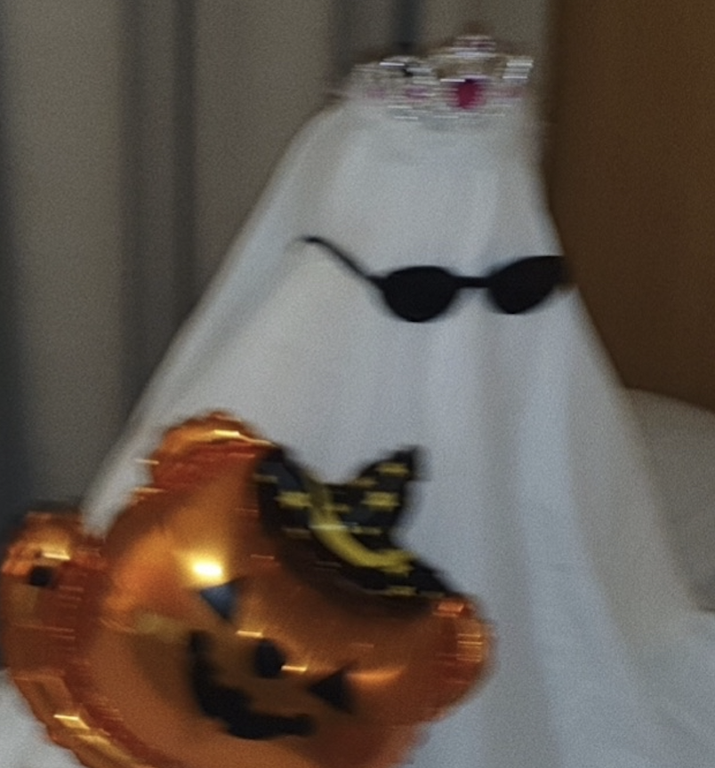
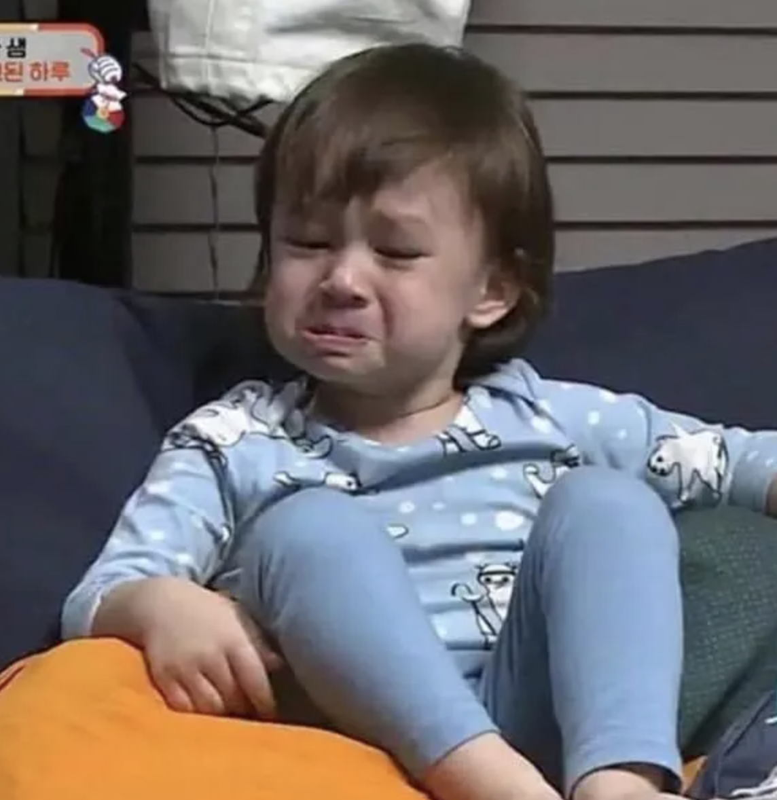
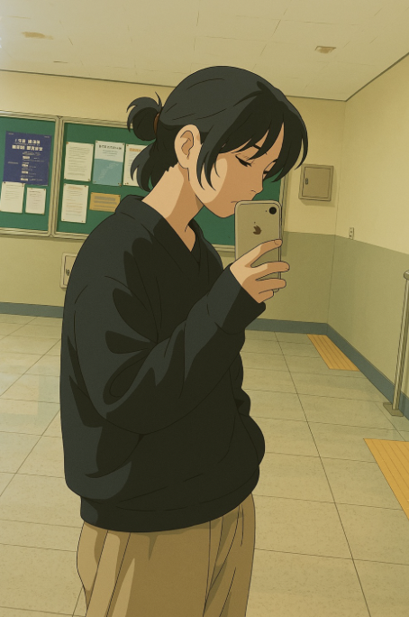

## 팀원소개

<table>
    <tr>
        <td style="text-align : =center;">
             
            <strong>윤소민</strong> 
            팀장 / 유저 개발 / 롯데
        </td>
        <td style="text-align : =center;">
             
            <strong>박경민</strong> 
            조원 / 시각화 / 한화
        </td>
        <td style="text-align : =center;">
             
            <strong>정명훈</strong> 
            조원 / 질문, 발표 / KIA
        </td>
    </tr>
</table>

## 프로젝트 목표
 - 하나의 서비를 만드는 것을 경험
 - Flask를 이용하여 개발 환경 초기 설정 방법 복습
 - 함수를 만들어보고, 함수를 연결할 Route 사용법 복습
 - SQLALchermy를 이용해 데이터 조작

## 프로젝트 기한
 ** 2025년 4월 24일 - 4월 28일 (5일) **

## 프로젝트 주제
 ** 프로야구 선호도 및 선호구단 설문조사 **
 사용자는 설문을 통해 선호구단을 선택하고
 모든 유저의 결과를 통계로 한 눈에 확인할 수 있습니다.

# flask-form
